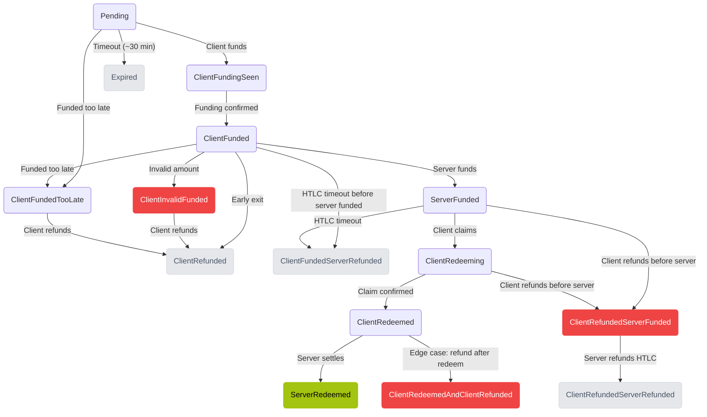

Satora Swaps swaps progress through a well-defined state machine that ensures atomicity and proper handling of all scenarios. The state machine is the same for both directions (BTC → EVM and EVM → BTC) - the difference is **which addresses** the client and server fund.

## Who Funds What

<Info>
The state machine is direction-agnostic. "Client funds" and "Server funds" refer to different addresses depending on the swap direction.
</Info>

### BTC → EVM (Client sends BTC, receives tokens)

| Step               | Who     | What                              | Address                                                                                     |
| ------------------ | ------- | --------------------------------- | ------------------------------------------------------------------------------------------- |
| **Client funds**   | Client  | Sends BTC                         | `boltz_invoice` (Lightning), `btc_vhtlc_address` (Arkade), or `btc_htlc_address` (On-chain) |
| **Server funds**   | Service | Locks tokens in EVM HTLC          | `evm_htlc_address` (the HTLC smart contract on Polygon/Ethereum/Arbitrum)                   |
| **Client claims**  | Client  | Reveals preimage, receives tokens | Claims from `evm_htlc_address` (gasless via EIP-712)                                        |
| **Server redeems** | Service | Extracts preimage, claims BTC     | Claims from Arkade VHTLC / Boltz / On-chain HTLC                                            |

### EVM → BTC (Client sends tokens, receives BTC)

**Gasless flow (recommended):**

| Step                       | Who     | What                                        | Address                                                                      |
| -------------------------- | ------- | ------------------------------------------- | ---------------------------------------------------------------------------- |
| **Client deposits**        | Client  | Sends stablecoins to deposit address        | **`client_evm_address`** - an SDK-derived address (NOT the HTLC)             |
| **Client funds (gasless)** | SDK     | Signs Permit2, server relays tokens to HTLC | Tokens move from `client_evm_address` → `evm_htlc_address` (server pays gas) |
| **Server funds**           | Service | Sends BTC to client                         | Pays Lightning invoice, funds Arkade VHTLC, or funds on-chain HTLC           |
| **Server claims**          | Service | Uses preimage to claim tokens               | Claims from `evm_htlc_address`                                               |

**Manual flow (with signer):**

| Step              | Who     | What                                       | Address                                                                                  |
| ----------------- | ------- | ------------------------------------------ | ---------------------------------------------------------------------------------------- |
| **Client funds**  | Client  | Approves + deposits tokens via Coordinator | `evm_htlc_address` via `HTLCCoordinator.executeAndCreateWithPermit2()` (client pays gas) |
| **Server funds**  | Service | Sends BTC to client                        | Pays Lightning invoice, funds Arkade VHTLC, or funds on-chain HTLC                       |
| **Server claims** | Service | Uses preimage to claim tokens              | Claims from `evm_htlc_address`                                                           |

<Warning>
**EVM → BTC gasless:** The user sends stablecoins to `client_evm_address`, **not** to `evm_htlc_address`. The SDK derives `client_evm_address` from the swap's secret key and uses Permit2 to relay tokens to the HTLC contract - the user never interacts with the HTLC directly.
</Warning>

---

## State Overview



---

## States Explained

| State                               | Description                                           | Action Required                                       |
| ----------------------------------- | ----------------------------------------------------- | ----------------------------------------------------- |
| **Pending**                         | Swap created, waiting for client to fund              | Fund the swap (see addresses above)                   |
| **ClientFundingSeen**               | Client's funding detected, waiting for confirmations  | Wait                                                  |
| **ClientFunded**                    | Client's funding confirmed, server preparing its side | Wait or early exit                                    |
| **ClientInvalidFunded**             | Client sent wrong amount or invalid funding           | Contact support                                       |
| **ClientFundedTooLate**             | Client funded after the swap expired                  | Refund                                                |
| **ServerFunded**                    | Server has funded - ready for final claim/settlement  | **Claim now** (BTC → EVM) or wait for BTC (EVM → BTC) |
| **ClientRedeeming**                 | Preimage revealed, claim in progress                  | Wait                                                  |
| **ClientRedeemed**                  | Client received funds, server settling                | Wait                                                  |
| **ServerRedeemed**                  | Swap fully complete - both sides settled              | None (terminal)                                       |
| **Expired**                         | Pending timeout, no funding received                  | None (terminal)                                       |
| **ClientRefunded**                  | Client exited early before server funded              | None (terminal)                                       |
| **ClientFundedServerRefunded**      | HTLC timeout, service reclaimed its funds             | Refund client side                                    |
| **ClientRefundedServerFunded**      | Client refunded but server had already funded         | Server reclaims                                       |
| **ClientRefundedServerRefunded**    | Both sides refunded                                   | None (terminal)                                       |
| **ClientRedeemedAndClientRefunded** | Edge case: client redeemed and also got refund        | None (terminal)                                       |

<Info>
**Early exit:** In the `ClientFunded` state, if the server hasn't funded its side yet, you can refund immediately without waiting for the timelock. The swap transitions to `ClientRefunded`.
</Info>

---

## Flow Examples

### BTC → EVM Success Flow

```
Pending → ClientFundingSeen → ClientFunded → ServerFunded → ClientRedeeming → ClientRedeemed → ServerRedeemed
```

The full happy path passes through `ClientRedeemed` before reaching `ServerRedeemed` - the server only settles after the client's claim is confirmed on-chain.

1. Client generates secret S, shares hash H with service
2. Client sends BTC to `boltz_invoice` (Lightning) / `btc_vhtlc_address` (Arkade) / `btc_htlc_address` (On-chain)
3. Payment detected (`ClientFundingSeen`), then confirmed (`ClientFunded`)
4. Service locks tokens in `evm_htlc_address` on EVM chain (`ServerFunded`)
5. Client reveals S, claims tokens from `evm_htlc_address` via gasless EIP-712 (`ClientRedeeming` → `ClientRedeemed`)
6. Service extracts S from blockchain, claims BTC (`ServerRedeemed`)

### EVM → BTC Success Flow (Gasless)

```
Pending → ClientFundingSeen → ClientFunded → ServerFunded → ClientRedeeming → ClientRedeemed → ServerRedeemed
```

1. Client creates swap - receives `client_evm_address` (SDK-derived deposit address)
2. Client sends stablecoins to **`client_evm_address`** (not the HTLC!)
3. SDK calls `fundSwapGasless()` - signs Permit2, server relays tokens from `client_evm_address` → `evm_htlc_address`
4. Funding detected (`ClientFundingSeen`), then confirmed (`ClientFunded`)
5. Service sends BTC to client's Arkade wallet / Lightning invoice / on-chain address (`ServerFunded`)
6. Service reveals preimage (`ClientRedeeming` → `ClientRedeemed`) and claims tokens from `evm_htlc_address` (`ServerRedeemed`)

### EVM → BTC Success Flow (Manual / With Signer)

```
Pending → ClientFundingSeen → ClientFunded → ServerFunded → ClientRedeeming → ClientRedeemed → ServerRedeemed
```

1. Client creates swap - receives `evm_htlc_address` and coordinator details
2. Client approves token spend, then calls `HTLCCoordinator.executeAndCreateWithPermit2()` to lock tokens in `evm_htlc_address` (client pays gas)
3. Funding detected (`ClientFundingSeen`), confirmed (`ClientFunded`)
4. Service sends BTC (`ServerFunded`)
5. Service reveals preimage (`ClientRedeeming` → `ClientRedeemed`) and claims tokens from `evm_htlc_address` (`ServerRedeemed`)

### Timeout Flow

```
Pending → ClientFunded → ServerFunded → ClientFundedServerRefunded
```

Client funded but didn't claim/settle within the HTLC timelock (24 hours on mainnet). Server reclaims its funds. Client can refund their side.

### Late Funding Flow

```
Pending → ClientFunded → ClientFundedTooLate → ClientRefunded
```

Client funded after the Lightning invoice / swap expired. Client refunds via locktime.

### Expiration Flow

```
Pending → Expired
```

Client never funded within the pending timeout (~30 minutes by default; configurable via `expire_pending_swaps`). No funds locked.

### Early Exit Flow

```
Pending → ClientFunded → ClientRefunded
```

Client funded but requested a refund before the server funded its side.

---

## Transition Rules

| From                       | Event                   | To                              | What happens                                                                |
| -------------------------- | ----------------------- | ------------------------------- | --------------------------------------------------------------------------- |
| Pending                    | Client funding detected | ClientFundingSeen               | BTC payment seen (BTC→EVM) or EVM deposit seen (EVM→BTC)                    |
| Pending                    | Timeout (~30 min)       | Expired                         | No funding received, swap cancelled (default 30 min, configurable)          |
| ClientFundingSeen          | Funding confirmed       | ClientFunded                    | Client's funding has enough confirmations                                   |
| ClientFunded               | Server funds its side   | ServerFunded                    | Service locks tokens in `evm_htlc_address` (BTC→EVM) or sends BTC (EVM→BTC) |
| ClientFunded               | Early exit requested    | ClientRefunded                  | Client refunds before server funded                                         |
| ClientFunded               | Invalid amount          | ClientInvalidFunded             | Wrong amount or invalid funding detected                                    |
| ClientFunded               | Funded too late         | ClientFundedTooLate             | Client funded after swap expired                                            |
| ServerFunded               | Preimage revealed       | ClientRedeeming                 | Client claims tokens (BTC→EVM) or service claims EVM HTLC (EVM→BTC)         |
| ServerFunded               | HTLC timeout            | ClientFundedServerRefunded      | Neither side claimed in time, server reclaims                               |
| ClientFunded               | HTLC timeout            | ClientFundedServerRefunded      | Server-side HTLC reclaimed before any redeem                                |
| ClientInvalidFunded        | Client refunds          | ClientRefunded                  | Client recovers funds after invalid funding                                 |
| ClientFundedTooLate        | Client refunds          | ClientRefunded                  | Client recovers funds after late funding                                    |
| ClientRedeeming            | Claim confirmed         | ClientRedeemed                  | Claim transaction confirmed on-chain                                        |
| ClientRedeemed             | Server settles          | ServerRedeemed                  | Server claims BTC (BTC→EVM) or tokens (EVM→BTC) - swap complete             |
| ClientRedeemed             | Refund races redeem     | ClientRedeemedAndClientRefunded | Critical edge case: client both redeemed and refunded                       |
| ServerFunded               | Client refunds early    | ClientRefundedServerFunded      | Critical: client refunded but server already funded                         |
| ClientRedeeming            | Client refunds          | ClientRefundedServerFunded      | Critical: client refunded mid-redeem                                        |
| ClientRefundedServerFunded | Server refunds          | ClientRefundedServerRefunded    | Server reclaims its HTLC funds, both sides refunded                         |

---

## Handling Each Status

```ts
const swaps = await client.listAllSwaps();

for (const stored of swaps) {
  const swap = stored.response;
  switch (swap.status) {
    case "pending":
      console.log(`Swap ${stored.swapId}: Awaiting payment`);
      break;
    case "clientfundingseen":
      console.log(`Swap ${stored.swapId}: Payment detected, confirming...`);
      break;
    case "clientfunded":
      console.log(`Swap ${stored.swapId}: Funded, waiting for HTLC`);
      break;
    case "serverfunded":
      console.log(`Swap ${stored.swapId}: Ready to claim!`);
      await client.claim(stored.swapId);
      break;
    case "clientredeeming":
      console.log(`Swap ${stored.swapId}: Claiming in progress...`);
      break;
    case "clientredeemed":
      console.log(`Swap ${stored.swapId}: Tokens received, server settling...`);
      break;
    case "serverredeemed":
      console.log(`Swap ${stored.swapId}: Complete!`);
      break;
    case "expired":
      console.log(`Swap ${stored.swapId}: Expired (no payment)`);
      break;
    case "clientrefunded":
      console.log(`Swap ${stored.swapId}: Refunded (early exit)`);
      break;
    case "clientfundedserverrefunded":
      console.log(`Swap ${stored.swapId}: Timed out - refund BTC`);
      break;
    case "clientinvalidfunded":
      console.log(`Swap ${stored.swapId}: Invalid funding`);
      break;
    case "clientfundedtoolate":
      console.log(`Swap ${stored.swapId}: Funded too late`);
      break;
    case "clientrefundedserverfunded":
      console.log(`Swap ${stored.swapId}: Refunded, server reclaiming`);
      break;
    case "clientrefundedserverrefunded":
      console.log(`Swap ${stored.swapId}: Both sides refunded`);
      break;
    case "clientredeemedandclientrefunded":
      console.log(`Swap ${stored.swapId}: Edge case resolved`);
      break;
    default:
      console.log(`Swap ${stored.swapId}: ${swap.status}`);
  }
}
```

---

## Terminal States

These states are final - no further transitions occur:

- `ServerRedeemed` - Success (both parties received funds)
- `Expired` - No payment was made
- `ClientRefunded` - Client exited early
- `ClientFundedServerRefunded` - EVM HTLC timed out
- `ClientRefundedServerRefunded` - Both sides refunded
- `ClientRedeemedAndClientRefunded` - Edge case resolved

---

## Best Practices

1. **Monitor `Pending` swaps** - Prompt users to pay before the ~30 minute timeout (default; configurable on the server)
2. **Auto-claim `ServerFunded`** - Claim immediately when ready
3. **Handle `ClientRedeeming`** - Show a loading state; claim is in progress
4. **Wait for `ServerRedeemed`** - This is the true success terminal, not `ClientRedeemed`
5. **Track terminal states** - Clean up UI for completed/expired swaps

---

## Resources

- [HTLC Details](/advanced/htlc)
